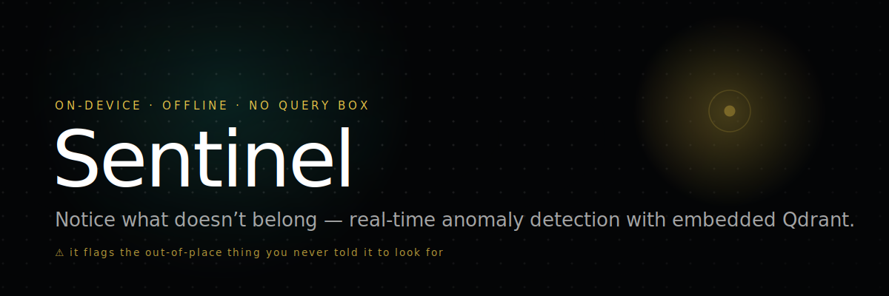
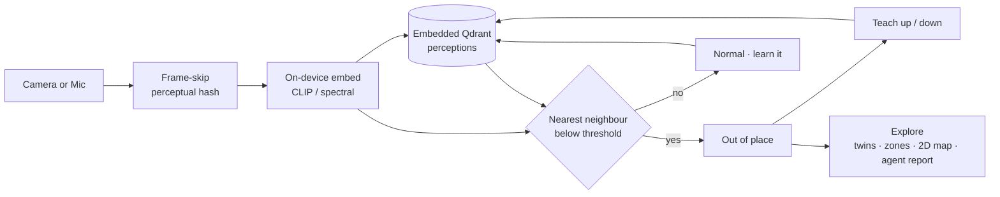
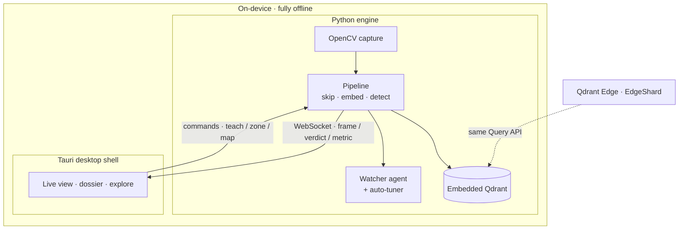

<div align="center">



&nbsp;

[](https://github.com/Enoch208/sentinel/actions/workflows/ci.yml)
[](LICENSE)


### On-device, fully-offline anomaly detection — it learns what's *normal* and flags **what doesn't belong**.

No query box. No chatbot. No cloud. Built for the Qdrant **"Think Outside the Bot"** Hackathon · embedded Qdrant, architected for **Qdrant Edge**.

</div>

---

## The idea

Vector search began as context for chatbots, then memory for agents. The third wave is **embedded** — AI moving to where decisions actually happen: cameras, robots, kiosks, factory floors, where the network is unreliable, latency budgets are tight, and data must stay private and local.

Most edge-perception demos answer *"where is the thing I'm looking for?"* Sentinel answers the **harder, inverse question** a safety inspector, a security guard, or a lab tech actually asks:

> **"What here is new, unexpected, or out of place?"**

You can't query for the thing you didn't know to look for — so Sentinel doesn't make you. It vectorizes what a camera (or microphone) perceives **on-device**, continuously compares it against the *normal* it has learned, and surfaces novelty the instant it appears. Private. Offline. Real-time. Qdrant is the engine, end to end.

## What it does — in 60 seconds

1. **Watch** — point the camera at a scene. Sentinel embeds frames on-device and forms a rolling model of "normal" in seconds.
2. **Flag** — introduce something out of place and the view glows **⚠ amber** within ~a second. *You never told it what to look for.*
3. **Inspect** — tap the flag for its nearest "normal" memories (the *why*) and its **visual twins** — everything that looks like it.
4. **Teach** — 👍 expected / 👎 anomaly. The memory adapts; benign changes stop flagging.
5. **Explore** — a 2D map of the whole perceptual memory, per-zone anomaly counts, and an agent's end-of-walk report.
6. **Pull the plug** — turn off wifi. **Nothing changes.** Offline isn't a mode; it's the architecture.

Every interaction is a gesture — **Watch / Teach / Explore** — never a typed query.

## Why it's different

- **It detects the unknown, not the known.** The headline is anomaly/novelty detection — the inverse of retrieval, and a genuinely harder problem on the edge.
- **It runs the entire pipeline on the device.** Capture → embed → store → query → flag, all in-process, with no network on the call path. The "wifi-off, still working" moment is structural, not staged.
- **It rides the 2026 stack.** Embedded Qdrant today, architected to drop onto **Qdrant Edge** with no change to the query logic; an autonomous **watcher agent**; and a **Skills-style auto-tuner** that fits the engine to the device.
- **It's multimodal.** The same vector-anomaly loop runs over a **microphone** to flag out-of-place *sounds* — true multimodal on the edge.
- **It's honest.** Every number in the dossier is read live from the running engine. Quantization reads `off` on the pure-embedded build (which doesn't quantize) and flips to `on · int8` against a real Qdrant or on Edge — it never fakes the figure.

## How it works



The loop is **modality-agnostic at the vector level** — the camera and the microphone share the same store, the same anomaly detector, and the same teach signal. Add a sense, and detection comes for free.

## The Qdrant engine

Sentinel runs Qdrant **in-process and fully offline** (`QdrantClient(path=…)`) — no server, no extra services, persists to disk. This shares the **same points & Query API as Qdrant Edge**, so the code path drops onto Edge's `EdgeShard` with no change to the query logic the moment beta access lands. Local mode is the runs-anywhere build shipped today; Edge is the production target.

| Capability | Where Sentinel uses it |
|---|---|
| **Nearest-neighbour `query_points`** | the hero anomaly loop, and the visual-twins lookup |
| **Facet** | per-zone anomaly review — tag frames by area, count anomalies where they happened |
| **Recommend** | example-based retrieval behind teach-by-example (👍/👎 → positive/negative) |
| **Scroll → on-device PCA** | projects the whole memory to a 2D map, anomalies highlighted |
| **Scalar quantization** | int8 vectors for a small on-device footprint — genuinely active with `make run-server` (real Qdrant) and on Edge; reported honestly (`off` on the pure-embedded build, which doesn't quantize) |

Collection `perceptions`: dense `clip` vectors (Cosine), payload `ts · frame_id · zone · flagged`, quantization configured.

## On-device proof

Edge is about resource constraints, so the proof *is* the product. The live dossier reports — from the running engine, never hardcoded — fps, per-frame embed & query latency, anomaly-detection latency, process footprint, memory size, and quantization state. And the detector is measured, not asserted:

```
$ uv run sentinel --synthetic
frame 12   learning normal…
frame 20   normal             score=0.998
frame 24   ⚠ OUT OF PLACE    score=0.852 < 0.946
frame 27   normal             score=0.998

$ uv run sentinel-eval
precision 1.000 · recall 1.000 · f1 1.000
```

## What's inside

- **Real-time anomaly detection** with an adaptive, tunable threshold and a live sensitivity control.
- **Teach-by-example** — reshape "normal" with a thumbs-up/down; subsequent detection measurably shifts.
- **Visual twins** — find everything in memory that looks like this.
- **Zones & facets** — review anomalies per area of a site.
- **Multimodal audio** — flag out-of-place sounds with the same engine.
- **Autonomous watcher** — clusters recurring anomalies into a reviewable end-of-walk report. Agentic, never conversational.
- **Self-tuning** — on launch, the engine picks quantization, frame-skip, and HNSW settings for the hardware it's on, with a stated rationale (the seam where **Qdrant Skills** plugs in).
- **2D explore canvas** — a PCA map of the perceptual memory; a supporting view, anomalies highlighted.
- **Provenance** — every flag, teach, and exploration recorded as an ordered, exportable session: an auditable inspection record.

## Quickstart

Requires [`uv`](https://docs.astral.sh/uv/), `npm`, and `cargo` (for the desktop shell).

```bash
make setup       # install all dependencies
make run         # launch the full instrument (embedded Qdrant, in-process, offline)
make run-server  # launch against a real Qdrant (Docker) — int8 quantization genuinely on, still offline
make demo        # headless proof: video anomaly + audio + precision/recall — no camera
make test        # every gate: engine (pytest/ruff/mypy) + desktop (vitest/build)
```

`make run` starts the engine, waits until it binds `ws://127.0.0.1:8765`, opens the desktop app, and shuts the engine down cleanly on exit. The desktop owns nothing but the view; the Python engine owns the camera and the memory.

## Architecture



| Path | What |
|---|---|
| `engine/` | Python perception engine — capture, on-device CLIP embedding, embedded Qdrant, anomaly loop, teach, twins, zones, audio, watcher agent, explore map, auto-tuner, FastAPI WebSocket server |
| `desktop/` | Tauri 2 desktop shell (React + TypeScript + Vite) — live view, ⚠ overlay, Watch/Teach/Explore, guided first-run, live dossier |
| `frontend/` | Marketing site (Next.js) |

The engine streams `frame` / `verdict` / `metric` events over a local WebSocket and accepts `sensitivity` / `teach` / `twins` / `zone` / `facet` / `report` / `map` / `reset` / `export` commands. Both the data path and the detector are covered by an automated test suite that runs without a camera, model download, or network.

## Built with

- **[Qdrant](https://qdrant.tech)** — embedded vector engine, architected for **Qdrant Edge**
- **[FastEmbed](https://github.com/qdrant/fastembed)** — on-device CLIP image embeddings (`Qdrant/clip-ViT-B-32-vision`)
- **[OpenCV](https://opencv.org)** · **[NumPy](https://numpy.org)** — capture, spectral audio features, PCA
- **[FastAPI](https://fastapi.tiangolo.com)** · **[Tauri](https://tauri.app)** · **[React](https://react.dev)** · **[Vite](https://vite.dev)**

---

<div align="center">

**Sentinel notices what you'd miss — privately, offline, on the device.**

</div>
